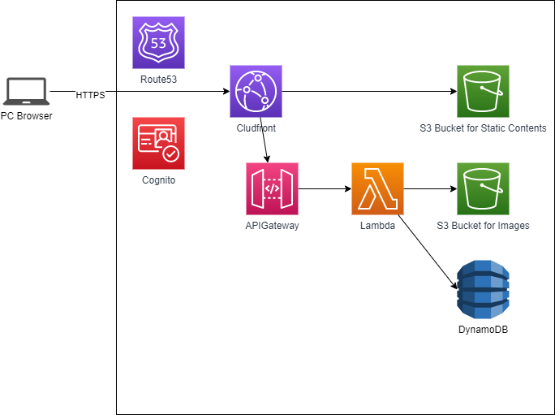

# album_server
自作アルバムアプリのサーバ実装用リポジトリです。
フロントエンド実装は[こちら](https://github.com/hiramee/album_front)

## デモ
https://album.hiramengo.com/

## 使用言語
- go 1.X  
LambdaのAPI実装で使用.サーバレス環境でのパフォーマンスを考慮してgoを選択した.
## 使用AWSサービス
- Lambda  
API実装で使用.稼働コストを抑えるためにサーバレス化している.
- API Gateway  
Lambda用のRest APIエンドポイントの作成に使用.認可はCognitoと統合したAuthorizerを使用.
- S3  
画像の保管とフロントエンドの静的ホスティングに使用.
- DynamoDB  
画像のメタデータとタグ情報の保管に使用.
- Cloudfront  
フロントエンドのキャッシングと、APIと静的コンテンツを同一オリジンにする際のパスベースルーティングで使用.
### 以下は本リポジトリ外で管理
- Route53  
独自ドメインを使用しているため、名前解決のために使用.
- Cognito  
認証、認可で使用.

## CICD
GitHub Actionsを使用してブランチpushの際のビルドとmasterコミットの際の自動デプロイを行っています。
